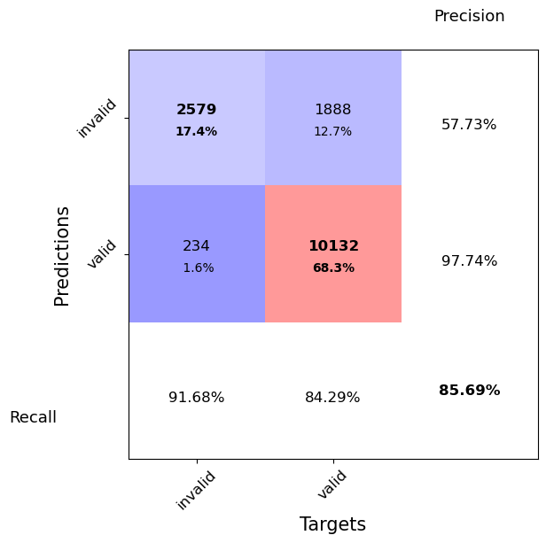
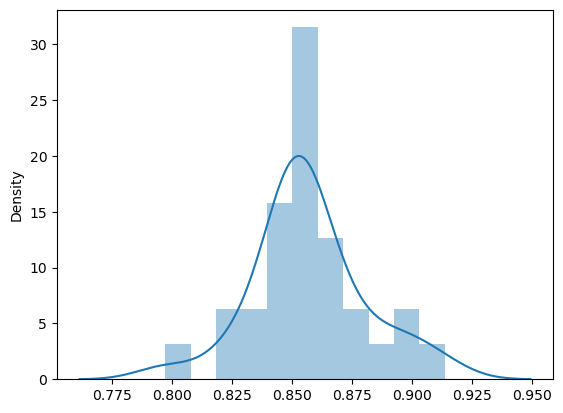
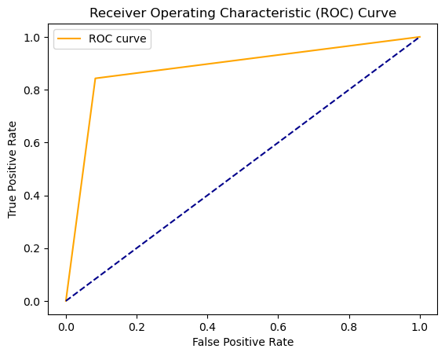
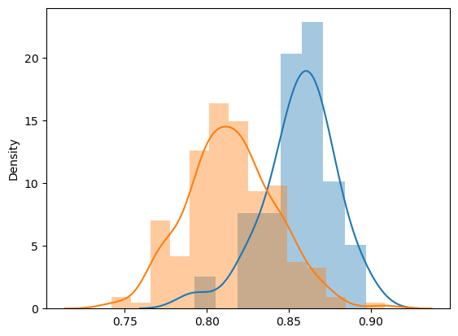
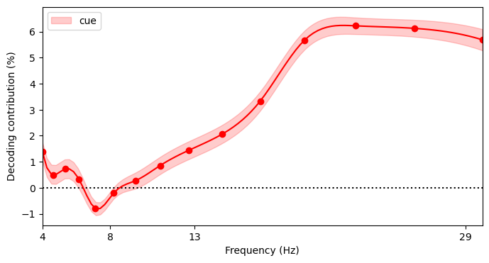
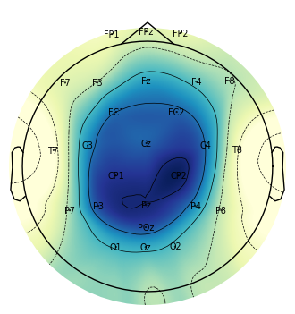
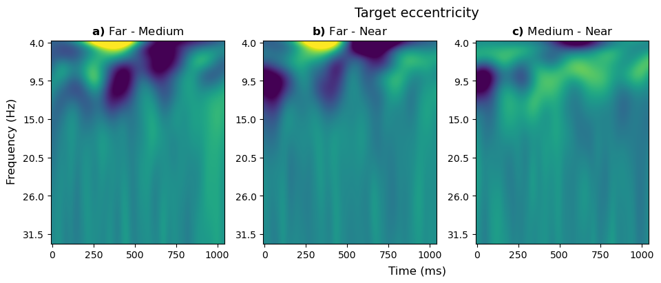
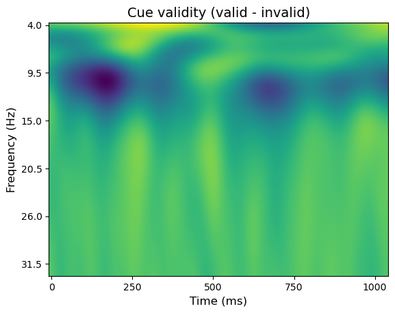

This script contains main target-evoked analyses for the following manuscript:
Vilotjević & Mathôt(in prep.) Decoding attentional breadth and selection from target-evoked activity

## Imports

This analysis relies on functions defined in [helper_eeg.py](helper_eeg.py).

```
from helper_eeg import *
```


    /home/ana/anaconda3/envs/pydata/lib/python3.10/site-packages/tqdm/auto.py:22: TqdmWarning: IProgress not found. Please update jupyter and ipywidgets. See https://ipywidgets.readthedocs.io/en/stable/user_install.html
      from .autonotebook import tqdm as notebook_tqdm


## Decoding Cue Validity from target-evoked activity


```
dm = DataMatrix()
for i, subject_nr in enumerate(SUBJECTS):
    sdm = memoize_decoding(subject_nr)
    if sdm.subject_nr == 2 and 'sub-01' in sdm.path[0]:
        print('fixing subject number for subject 1')
        sdm.subject_nr = 1
    dm <<= sdm
```


    decoding 1
    fixing subject number for subject 1
    decoding 2
    decoding 3
    decoding 4
    decoding 5
    decoding 6
    decoding 7
    decoding 8
    decoding 9
    decoding 10
    decoding 11
    decoding 12
    decoding 13
    decoding 14
    decoding 15
    decoding 16
    decoding 17
    decoding 18
    decoding 19
    decoding 20
    decoding 21
    decoding 22
    decoding 23
    decoding 24
    decoding 25
    decoding 26
    decoding 27
    decoding 28
    decoding 29
    decoding 30


Visualize decoding results


```
LABELS = [
    'invalid',
    'valid'
]

visualize_decoding(dm, LABELS,45)
```


    

    


    


Check decoding accuracy


```
factor_name = 'cue validity'
factor_decoding = []
for subject_nr, sdm in ops.split(dm.subject_nr):
    print(f'For subject {subject_nr}, att_br decoding is {sdm.braindecode_correct.mean}')
    factor_decoding.append(sdm.braindecode_correct.mean)
print('Overall decoding')
print(f'{factor_name}: {dm.braindecode_correct.mean}')


sns.distplot(factor_decoding)
```


    For subject 1, att_br decoding is 0.8545816733067729
    For subject 2, att_br decoding is 0.8553191489361702
    For subject 3, att_br decoding is 0.846307385229541
    For subject 4, att_br decoding is 0.8522954091816367
    For subject 5, att_br decoding is 0.856
    For subject 6, att_br decoding is 0.8705179282868526
    For subject 7, att_br decoding is 0.8585657370517928
    For subject 8, att_br decoding is 0.865424430641822
    For subject 9, att_br decoding is 0.8483033932135728
    For subject 10, att_br decoding is 0.8513238289205702
    For subject 11, att_br decoding is 0.8472505091649695
    For subject 12, att_br decoding is 0.8380566801619433
    For subject 13, att_br decoding is 0.8214285714285714
    For subject 14, att_br decoding is 0.7971014492753623
    For subject 15, att_br decoding is 0.898406374501992
    For subject 16, att_br decoding is 0.8472222222222222
    For subject 17, att_br decoding is 0.8608349900596421
    For subject 18, att_br decoding is 0.8511904761904762
    For subject 19, att_br decoding is 0.8473895582329317
    For subject 20, att_br decoding is 0.8531746031746031
    For subject 21, att_br decoding is 0.8358862144420132
    For subject 22, att_br decoding is 0.8739837398373984
    For subject 23, att_br decoding is 0.8523908523908524
    For subject 24, att_br decoding is 0.9134808853118712
    For subject 25, att_br decoding is 0.8993839835728953
    For subject 26, att_br decoding is 0.8810483870967742
    For subject 27, att_br decoding is 0.8511904761904762
    For subject 28, att_br decoding is 0.8877755511022044
    For subject 29, att_br decoding is 0.8273809523809523
    For subject 30, att_br decoding is 0.8634453781512605
    Overall decoding
    cue validity: 0.8569406054068631
    /tmp/ipykernel_352340/1204650721.py:10: UserWarning: 
    
    `distplot` is a deprecated function and will be removed in seaborn v0.14.0.
    
    Please adapt your code to use either `displot` (a figure-level function with
    similar flexibility) or `histplot` (an axes-level function for histograms).
    
    For a guide to updating your code to use the new functions, please see
    https://gist.github.com/mwaskom/de44147ed2974457ad6372750bbe5751
    
      sns.distplot(factor_decoding)
    <Axes: ylabel='Density'>


    

    


    


Assess decoder's performance (d prime)


```
true_labels = dm.braindecode_label
predicted_labels = dm.braindecode_prediction

tn, fp, fn, tp = confusion_matrix(true_labels, predicted_labels).ravel()

tpr = tp / (tp + fn) # True positive rate; hit rate
fpr = fp / (fp + tn) # False positive rate; false alarm rate

print(f"True positive rate is {tpr}")
print(f"False positive rate is {fpr}")

correctly_classified = tp+tn 
assert correctly_classified == sum(dm.braindecode_correct)


d_prime = norm.ppf(tpr) - norm.ppf(fpr)
print(f"d' is {d_prime}")

d_primes = []
for subject_nr, sdm in ops.split(dm.subject_nr):
    true_labels = sdm.braindecode_label
    predicted_labels = sdm.braindecode_prediction
    tn, fp, fn, tp = confusion_matrix(true_labels, predicted_labels).ravel()
    tpr = tp / (tp + fn) # True positive rate; hit rate
    fpr = fp / (fp + tn) # False positive rate; false alarm rate
    d_prime = norm.ppf(tpr) - norm.ppf(fpr)
    d_primes.append(d_prime)
    print(f"d' for {subject_nr} :", d_prime)

print(f'Statistical testing of d prime --> {ttest_1samp(d_primes, 0)}')
```


    True positive rate is 0.8429284525790349
    False positive rate is 0.08318521151795237
    d' is 2.3905275078940367
    d' for 1 : 2.3222343172900954
    d' for 2 : 2.399452673712113
    d' for 3 : 2.180285901216712
    d' for 4 : 2.2607709111310843
    d' for 5 : 2.514836824515209
    d' for 6 : 2.667418601512097
    d' for 7 : 2.338611485967489
    d' for 8 : 2.479582800838382
    d' for 9 : 2.399310992809249
    d' for 10 : 2.153502234325055
    d' for 11 : 2.388429856232869
    d' for 12 : 2.290942226751271
    d' for 13 : 2.164896615805781
    d' for 14 : 2.085486411636587
    d' for 15 : 2.689627251666392
    d' for 16 : 2.285432463405238
    d' for 17 : 2.30125091822919
    d' for 18 : 2.421829168957742
    d' for 19 : 2.553315708594684
    d' for 20 : 2.2202019897447673
    d' for 21 : 2.1224640680253044
    d' for 22 : 2.5966734079582503
    d' for 23 : 2.3418794859244594
    d' for 24 : 2.8530790762038056
    d' for 25 : 2.9139298459750926
    d' for 26 : 2.6449867979044885
    d' for 27 : 2.3052418892937125
    d' for 28 : 2.7605292804301333
    d' for 29 : 2.310120033449013
    d' for 30 : 2.3393322508545644
    Statistical testing of d prime --> TtestResult(statistic=61.0791853507679, pvalue=3.417241276763419e-32, df=29)


Assess decoder's performance (AUC)


```
true_labels = dm.braindecode_label 
predicted_labels = dm.braindecode_prediction

auc_score = roc_auc_score(true_labels, predicted_labels)
print("AUC score:", auc_score)

fpr, tpr, thresholds = roc_curve(true_labels, predicted_labels)

plt.plot(fpr, tpr, color='orange', label='ROC curve')
plt.plot([0, 1], [0, 1], color='darkblue', linestyle='--')
plt.xlabel('False Positive Rate')
plt.ylabel('True Positive Rate')
plt.title('Receiver Operating Characteristic (ROC) Curve')
plt.legend()
plt.show()

AUC_scores = []
for subject_nr, sdm in ops.split(dm.subject_nr):
    true_labels = sdm.braindecode_label
    predicted_labels = sdm.braindecode_prediction
    auc_score = roc_auc_score(true_labels, predicted_labels)
    AUC_scores.append(auc_score)
    print(f"AUC score for {subject_nr} :", auc_score)
print(f'Statistical testing of AUC --> {ttest_1samp(AUC_scores, 0.5)}')
```


    AUC score: 0.8798716205305412


    

    


    AUC score for 1 : 0.8743072660098522
    AUC score for 2 : 0.8801356501905705
    AUC score for 3 : 0.8608244749805548
    AUC score for 4 : 0.8689043209876542
    AUC score for 5 : 0.8870668316831682
    AUC score for 6 : 0.8999741368162422
    AUC score for 7 : 0.8764645027802923
    AUC score for 8 : 0.8880066170388752
    AUC score for 9 : 0.8779993726802237
    AUC score for 10 : 0.8588507051385962
    AUC score for 11 : 0.8769384557194575
    AUC score for 12 : 0.8676691729323308
    AUC score for 13 : 0.8538602941176471
    AUC score for 14 : 0.8408429818057378
    AUC score for 15 : 0.9093544745484401
    AUC score for 16 : 0.8697916666666667
    AUC score for 17 : 0.8738390092879257
    AUC score for 18 : 0.8802083333333334
    AUC score for 19 : 0.8856498756218905
    AUC score for 20 : 0.8655024509803921
    AUC score for 21 : 0.8538108791903858
    AUC score for 22 : 0.8975664968873799
    AUC score for 23 : 0.8752747252747253
    AUC score for 24 : 0.9221793991869489
    AUC score for 25 : 0.9212037962037961
    AUC score for 26 : 0.9023362646016538
    AUC score for 27 : 0.8722426470588236
    AUC score for 28 : 0.910441292356186
    AUC score for 29 : 0.8655024509803921
    AUC score for 30 : 0.8774611398963731
    Statistical testing of AUC --> TtestResult(statistic=105.29798144238052, pvalue=5.0777226228273347e-39, df=29)


## Frequency band contributions
Frequency-band perturbation analysis


```
FACTORS  = ['cue']
N_SUB = len(SUBJECTS)
grand_data = np.empty((N_SUB, len(NOTCH_FREQS)))
for i, subject_nr in enumerate(SUBJECTS[:N_SUB]):
    print(f'Frequency perturbation analysis for {subject_nr}')
    fdm, perturbation_results = freq_perturbation_decode(subject_nr)
    gm = fdm.braindecode_correct.mean
    data = np.array([r.braindecode_correct.mean
                    for r in perturbation_results.values()])
    data = (data - gm) / gm
    grand_data[i] = data


## Sanity check

real_accuracy = []
lesioned_accuracy = []
for i, subject_nr in enumerate(SUBJECTS[:N_SUB]):
    print(f'Frequency perturbation analysis for {subject_nr}')
    fdm, perturbation_results = freq_perturbation_decode(subject_nr)
    real_accuracy.append(fdm.braindecode_correct.mean)
    lesioned_accuracy += [ldm.braindecode_correct.mean
                          for freq, ldm in perturbation_results.items()
                          if freq > 13]


sns.distplot(real_accuracy)
sns.distplot(lesioned_accuracy)
```


    Frequency perturbation analysis for 1
    Frequency perturbation analysis for 2
    Frequency perturbation analysis for 3
    Frequency perturbation analysis for 4
    Frequency perturbation analysis for 5
    Frequency perturbation analysis for 6
    Frequency perturbation analysis for 7
    Frequency perturbation analysis for 8
    Frequency perturbation analysis for 9
    Frequency perturbation analysis for 10
    Frequency perturbation analysis for 11
    Frequency perturbation analysis for 12
    Frequency perturbation analysis for 13
    Frequency perturbation analysis for 14
    Frequency perturbation analysis for 15
    Frequency perturbation analysis for 16
    Frequency perturbation analysis for 17
    Frequency perturbation analysis for 18
    Frequency perturbation analysis for 19
    Frequency perturbation analysis for 20
    Frequency perturbation analysis for 21
    Frequency perturbation analysis for 22
    Frequency perturbation analysis for 23
    Frequency perturbation analysis for 24
    Frequency perturbation analysis for 25
    Frequency perturbation analysis for 26
    Frequency perturbation analysis for 27
    Frequency perturbation analysis for 28
    Frequency perturbation analysis for 29
    Frequency perturbation analysis for 30
    Frequency perturbation analysis for 1
    Frequency perturbation analysis for 2
    Frequency perturbation analysis for 3
    Frequency perturbation analysis for 4
    Frequency perturbation analysis for 5
    Frequency perturbation analysis for 6
    Frequency perturbation analysis for 7
    Frequency perturbation analysis for 8
    Frequency perturbation analysis for 9
    Frequency perturbation analysis for 10
    Frequency perturbation analysis for 11
    Frequency perturbation analysis for 12
    Frequency perturbation analysis for 13
    Frequency perturbation analysis for 14
    Frequency perturbation analysis for 15
    Frequency perturbation analysis for 16
    Frequency perturbation analysis for 17
    Frequency perturbation analysis for 18
    Frequency perturbation analysis for 19
    Frequency perturbation analysis for 20
    Frequency perturbation analysis for 21
    Frequency perturbation analysis for 22
    Frequency perturbation analysis for 23
    Frequency perturbation analysis for 24
    Frequency perturbation analysis for 25
    Frequency perturbation analysis for 26
    Frequency perturbation analysis for 27
    Frequency perturbation analysis for 28
    Frequency perturbation analysis for 29
    Frequency perturbation analysis for 30
    /tmp/ipykernel_352340/2430223811.py:27: UserWarning: 
    
    `distplot` is a deprecated function and will be removed in seaborn v0.14.0.
    
    Please adapt your code to use either `displot` (a figure-level function with
    similar flexibility) or `histplot` (an axes-level function for histograms).
    
    For a guide to updating your code to use the new functions, please see
    https://gist.github.com/mwaskom/de44147ed2974457ad6372750bbe5751
    
      sns.distplot(real_accuracy)
    /tmp/ipykernel_352340/2430223811.py:28: UserWarning: 
    
    `distplot` is a deprecated function and will be removed in seaborn v0.14.0.
    
    Please adapt your code to use either `displot` (a figure-level function with
    similar flexibility) or `histplot` (an axes-level function for histograms).
    
    For a guide to updating your code to use the new functions, please see
    https://gist.github.com/mwaskom/de44147ed2974457ad6372750bbe5751
    
      sns.distplot(lesioned_accuracy)
    <Axes: ylabel='Density'>


    

    


    


Plot frequency contribution


```
FACTORS  = 'cue'
factor = FACTORS
plt.figure(figsize=(8, 4))
plt.axhline(0, linestyle=':', color='black')
x = np.linspace(NOTCH_FREQS.min(), NOTCH_FREQS.max(), 100)
zdata = -100 * grand_data.copy()
grand_mean = zdata.mean()
for i in range(len(SUBJECTS)):
    zdata[i] -= zdata[i].mean()
zdata += grand_mean
mean = zdata.mean(axis=0)
err = zdata.std(axis=0) / np.sqrt(len(SUBJECTS))
spline_y = make_interp_spline(NOTCH_FREQS, mean)(x)
spline_err = make_interp_spline(NOTCH_FREQS, err)(x)
plt.fill_between(x, spline_y - spline_err, spline_y + spline_err, alpha=.2,
                 label=factor, color='red')
plt.plot(NOTCH_FREQS, mean, 'o', color='red')
plt.plot(x, spline_y, '-', color='red')
plt.xlim(NOTCH_FREQS.min(), NOTCH_FREQS.max())
plt.xlabel('Frequency (Hz)')
plt.ylabel('Decoding contribution (%)')
plt.xticks([4, 8, 13, 29])
plt.legend()
plt.show()
```


    

    


    


Statistically test frequency contributions
Conduct a repeated measures ANOVA to test the effect of frequency band and
factor on decoding weights. This is done on the non-z-scored data.


```
sdm = DataMatrix(length=N_SUB * len(NOTCH_FREQS))
for row, (subject_nr, freq) in zip(
        sdm, it.product(range(N_SUB), range(len(NOTCH_FREQS)))):
    row.subject_nr = SUBJECTS[subject_nr]
    row.freqs = NOTCH_FREQS[freq]
    row.weight = grand_data[subject_nr, freq]
aov = pg.rm_anova(dv='weight', within=['freqs'],
                  subject='subject_nr', data=sdm)
print(aov)
```


      Source  ddof1  ddof2          F         p-unc       ng2       eps
    0  freqs     14    406  48.861519  5.673336e-78  0.481086  0.499004


## Channels contribution


```
FACTORS  = ['cue']
N_SUB = len(SUBJECTS)
grand_data = np.empty((N_SUB, 26))
for i, subject_nr in enumerate(SUBJECTS[:N_SUB]):
    print(f'ICA perturbation analysis for {subject_nr}')
    fdm, perturbation_results = ica_perturbation_decode(subject_nr)
    blame_dict = {}
    for component, (sdm, weights_dict) in perturbation_results.items():
        punishment = (fdm.braindecode_correct.mean -
            sdm.braindecode_correct.mean) / fdm.braindecode_correct.mean
        for ch, w in weights_dict.items():
            if ch not in blame_dict:
                blame_dict[ch] = 0
            blame_dict[ch] += punishment * abs(w)
    data = np.array(list(blame_dict.values()))
    grand_data[i] = data
```


    ICA perturbation analysis for 1
    ICA perturbation analysis for 2
    ICA perturbation analysis for 3
    ICA perturbation analysis for 4
    ICA perturbation analysis for 5
    ICA perturbation analysis for 6
    ICA perturbation analysis for 7
    ICA perturbation analysis for 8
    ICA perturbation analysis for 9
    ICA perturbation analysis for 10
    ICA perturbation analysis for 11
    ICA perturbation analysis for 12
    ICA perturbation analysis for 13
    ICA perturbation analysis for 14
    ICA perturbation analysis for 15
    ICA perturbation analysis for 16
    ICA perturbation analysis for 17
    ICA perturbation analysis for 18
    ICA perturbation analysis for 19
    ICA perturbation analysis for 20
    ICA perturbation analysis for 21
    ICA perturbation analysis for 22
    ICA perturbation analysis for 23
    ICA perturbation analysis for 24
    ICA perturbation analysis for 25
    ICA perturbation analysis for 26
    ICA perturbation analysis for 27
    ICA perturbation analysis for 28
    ICA perturbation analysis for 29
    ICA perturbation analysis for 30


Plot channel contribution


```
def read_subject(subject_nr):
    return eet.read_subject(subject_nr=subject_nr,
                            saccade_annotation='BADS_SACCADE',
                            min_sacc_size=128)


raw, events, metadata = read_subject(SUBJECTS[0])
MAX = 1
COLORMAP = 'YlGnBu'

zdata = grand_data.copy()

for i in range(zdata.shape[0]):
    print(f'subject {SUBJECTS[i]}: M={zdata[i].mean()}, SD={zdata[i].std()}')
    zdata[i] -= zdata[i].mean()
    print(zdata[i])
    zdata[i] /= zdata[i].std()
print('Cue validity')
mne.viz.plot_topomap(zdata[:].mean(axis=0), raw.info, size=4,
                     names=raw.info['ch_names'], #vmin=-MAX, vmax=MAX,
                     cmap=COLORMAP, show=False)
plt.show()
```


    subject 1: M=0.011603681103533717, SD=0.005982187062710716
    [-0.00890297 -0.0059738  -0.00940741 -0.0053023  -0.00103764 -0.00201576
     -0.0053534  -0.00340147  0.002352    0.00241091 -0.01012511  0.00230687
      0.00089367 -0.0004644  -0.01089932  0.0003796   0.00465098  0.00248979
      0.0045726   0.00458844  0.00952722  0.00317915  0.01130892  0.00836951
     -0.00085714  0.00671104]
    subject 2: M=0.0007272297634295654, SD=0.0009587275231509
    [-7.22930938e-04 -6.90425091e-04  1.38984539e-04 -3.25957674e-04
     -3.74903329e-04 -5.66282522e-04 -3.46081387e-04 -5.95147184e-04
     -7.27127087e-04 -7.27169256e-04 -7.31308941e-06 -6.66632231e-05
      4.88870275e-04 -7.27037198e-04 -5.18517983e-04  2.58706827e-03
      1.33393677e-03  2.26247328e-04  1.88742798e-03  2.43426452e-03
     -4.81271522e-04 -3.66827465e-04 -7.25988589e-04  1.36356958e-04
     -5.36840702e-04 -7.26672403e-04]
    subject 3: M=0.012458168650186159, SD=0.011230382327291536
    [-1.10000776e-02 -1.16407591e-02 -1.21878996e-02 -8.11216348e-03
      2.33649262e-03  1.08172309e-02  1.44974800e-03 -7.66922023e-03
      1.43577270e-02  2.32211934e-02 -9.70386555e-03  4.81600901e-03
      8.06921574e-03  2.53227171e-05 -7.72741241e-03  1.77187984e-02
     -1.23031588e-02 -4.83692549e-03  3.38075074e-04  8.66009817e-03
     -5.31261972e-03 -8.15402157e-03  2.52640760e-02 -1.21555739e-02
      6.16866021e-03 -1.24389498e-02]
    subject 4: M=0.003529531154066938, SD=0.0075135872025515835
    [-0.00226914 -0.00352038 -0.00329005 -0.00274737 -0.001466    0.00058729
     -0.00347098 -0.00245272 -0.00294914 -0.00177374 -0.00348461 -0.00222146
     -0.00352471 -0.00325565 -0.00273936 -0.00351217 -0.00336351  0.00812648
     -0.00352903 -0.00349322 -0.0007066  -0.00273104  0.004063    0.03023884
      0.01693477 -0.0034495 ]
    subject 5: M=0.021385329763114858, SD=0.014299131154032406
    [-0.01417113 -0.01663055 -0.01616546 -0.00726877 -0.0176409   0.01223032
      0.00701532  0.00386076  0.0163708   0.0082537  -0.01984831  0.00020853
      0.00555448  0.02086228 -0.02077294  0.01089753  0.00627707 -0.01497249
      0.01765703  0.01495693  0.03069019 -0.01569618 -0.00565706  0.00557975
     -0.01402735  0.00243647]
    subject 6: M=0.023135573488234903, SD=0.014552532598437114
    [-0.01929179 -0.01293715 -0.01846347 -0.0180531  -0.01082019 -0.00892892
     -0.0026653  -0.01179844  0.01487844  0.01864264 -0.02047922  0.01410406
      0.00738302  0.01065597 -0.01500309  0.02387528  0.02075089 -0.0086571
     -0.00995484  0.01662135 -0.00409858 -0.01199232  0.02094652  0.00804047
      0.00111678  0.0161281 ]
    subject 7: M=0.008942957559808229, SD=0.006702985834343512
    [ 0.00308549 -0.00751565 -0.00468555 -0.00840213 -0.00866571 -0.00798855
     -0.00272048 -0.00192845  0.00177771  0.00269842 -0.00868252  0.00273417
      0.00847862  0.00509965 -0.00732051  0.00285456  0.00572008  0.00826936
      0.01282828  0.00590246  0.00302042  0.00364578  0.01165462 -0.0088986
     -0.0034015  -0.00755995]
    subject 8: M=-0.0027563808819751168, SD=0.0013975765307717772
    [ 0.00033702 -0.00096681  0.00097446  0.00023631 -0.00048684  0.00107779
      0.00066299  0.00185813 -0.00064393  0.00284752  0.00087578 -0.00157067
     -0.00082874 -0.00180118  0.00197533 -0.00108316  0.00244283 -0.00287678
      0.00013272  0.00057825 -0.0005507  -0.0002968   0.00010486 -0.00073234
      0.00037936 -0.00264539]
    subject 9: M=0.008088677328138406, SD=0.004200111165097045
    [-6.10941669e-03 -4.99781468e-03 -5.57009502e-03 -3.75429847e-03
     -2.45352238e-04  1.15749836e-05 -9.05673921e-04  1.78671847e-03
      5.34501409e-03  5.10235487e-03 -6.06343524e-03  2.39625809e-03
      1.42464581e-03 -2.91959044e-03 -5.23290467e-03  4.87987459e-03
      1.46112030e-03 -3.06599503e-03  6.25602274e-03  6.84819648e-03
      3.72291189e-03 -4.50859026e-03  7.04898054e-03 -1.35917756e-03
     -2.15585169e-03  6.04523022e-04]
    subject 10: M=0.009435173138622499, SD=0.00800443567850508
    [-0.00404392  0.0020657  -0.00257633 -0.00870068 -0.00916903  0.01058929
      0.00959814  0.00745117  0.0134681   0.01247366 -0.00490329  0.00761891
     -0.00029109  0.00650112 -0.00840945  0.00935148  0.00401031 -0.00842053
      0.00864528  0.00284534 -0.00196968 -0.00929853 -0.00934558 -0.00902401
     -0.00918987 -0.00927652]
    subject 11: M=0.016246108974172974, SD=0.011143387007335212
    [-0.0141643   0.00046273 -0.01442362 -0.00848314 -0.00942685  0.00287375
     -0.01009195 -0.00496633  0.0235313   0.00563607 -0.01114577 -0.00561604
      0.01468986  0.00446175 -0.01333686  0.0117323   0.00289919 -0.01351366
     -0.00107293  0.01373036  0.01847844 -0.00046514 -0.01330458 -0.0015579
      0.00589744  0.01717587]
    subject 12: M=-0.005077076157068589, SD=0.0018277380918495807
    [ 7.04794270e-04  1.23412866e-03  1.88788727e-03  2.22859495e-03
      1.00559417e-03  9.18234241e-04 -5.38963175e-05  2.95152527e-03
      2.10082600e-04 -6.68258932e-04  1.37869942e-03 -7.18987715e-04
     -1.02389330e-04 -4.74741887e-04 -2.48967735e-03 -1.14641963e-03
     -6.20788267e-05 -1.54952521e-03  5.02738382e-03 -4.66994481e-04
     -2.18582664e-04 -1.95869145e-03  5.50013426e-04 -2.08929136e-03
     -2.90511585e-03 -3.19228709e-03]
    subject 13: M=0.009496521281907266, SD=0.005140248857229522
    [-0.00838312 -0.00305399 -0.00242883 -0.00763907 -0.00243401 -0.00021681
     -0.00317136 -0.00787493  0.00600875 -0.00384852 -0.00831644  0.00347568
      0.00464028  0.0044373   0.00342708  0.00411821  0.00118459 -0.00687613
      0.00361263  0.00249198  0.00599273 -0.00457326  0.00755814 -0.00016252
      0.00393209  0.00809952]
    subject 14: M=0.001742875738623111, SD=0.0009677430716660708
    [-0.00057808 -0.00115436 -0.00136019 -0.00124924 -0.00084613 -0.00081851
      0.00065669 -0.0012644   0.00047412  0.00122408 -0.00091097  0.00030078
      0.00096274  0.00051657 -0.00108711  0.00061669  0.00194379  0.0002991
      0.00070653  0.00154186 -0.00054249 -0.00112026 -0.00045367  0.00094551
      0.00018172  0.00101523]
    subject 15: M=-0.003241121902109759, SD=0.0016156781285256222
    [-0.00396392  0.00057215 -0.00158284 -0.00116042 -0.0009172  -0.0017708
      0.00307986 -0.00124647 -0.00247724  0.00314369  0.00068748  0.00204852
      0.00056137 -0.00123946 -0.00026995  0.00059555  0.00075218  0.00151409
     -0.0002441   0.00071831  0.00050457  0.00112887 -0.00167364  0.00142049
     -0.00040447  0.00022336]
    subject 16: M=0.013264820629147318, SD=0.009817698945512678
    [-0.00944292 -0.00818853 -0.01049724 -0.00971249 -0.00622008 -0.00249585
      0.00355804 -0.00883681  0.01472759  0.01542469 -0.0119793   0.00171676
      0.01438448 -0.00759016 -0.0107889   0.017262    0.01923145 -0.00995603
     -0.00379171  0.00728236  0.00872257 -0.00946238  0.00262799  0.00367787
      0.00204222 -0.00169562]
    subject 17: M=0.014587652132465292, SD=0.018888516886979012
    [-0.01099633 -0.00891984 -0.00689579 -0.00799873 -0.0102266  -0.01028421
     -0.01344112 -0.00822169 -0.00714295  0.00383963 -0.01442167 -0.0062404
     -0.00101295  0.02746621 -0.01425799  0.00573622  0.07197368 -0.01399031
     -0.00209074  0.01914349 -0.00148448 -0.01289145  0.02184744 -0.0088045
      0.02320286 -0.01388778]
    subject 18: M=0.0004149148103126495, SD=0.00030250737115619707
    [-2.72072653e-04 -1.25855829e-04 -2.97434125e-04 -1.32755567e-05
     -3.67362581e-05 -3.54704118e-04 -4.13875447e-04 -1.48527452e-04
     -2.31256379e-04 -4.13222013e-04 -4.10562185e-04  1.31002799e-04
     -1.01791282e-04  5.68021570e-04 -8.90108241e-05  4.87640101e-05
      1.77131287e-04  5.47267999e-04  1.51634838e-04 -1.62113581e-04
     -3.19769600e-05  6.93588744e-04 -7.52823651e-05  2.58051828e-04
      2.26458895e-04  3.75775056e-04]
    subject 19: M=0.0014372543003586117, SD=0.000755156812250908
    [-7.06713181e-04 -8.36881448e-05 -1.25618533e-03 -5.30611732e-04
      9.88855113e-05  4.27573849e-04 -1.30569108e-04 -4.97345891e-04
     -2.14664015e-05 -1.19209528e-03 -2.73481644e-04 -1.42921239e-03
     -1.31504330e-03  6.47491316e-04 -7.16258104e-04  8.18828835e-04
      6.70374015e-04  5.72673263e-04  4.33204270e-04  1.72706375e-05
      2.75744021e-04  1.13760302e-03  8.74353338e-04  6.34753589e-04
      3.03988381e-04  1.23992647e-03]
    subject 20: M=0.013645408619131815, SD=0.007754888474232022
    [ 9.35226415e-04 -8.55968359e-03 -5.31772176e-03 -5.86720702e-03
      4.57830882e-03  1.32528460e-02 -3.73327196e-03 -4.75667095e-03
      2.01030840e-03  6.08295797e-03 -1.35542425e-02  6.42311600e-03
      1.15993357e-02 -3.30230325e-05 -7.64625300e-03  9.15163820e-03
     -1.35992433e-02 -5.03159280e-04  1.04575350e-02  8.19821544e-03
     -8.37723456e-03 -1.08241814e-02  6.71253242e-03 -1.92006724e-03
      7.05896505e-03 -1.76902571e-03]
    subject 21: M=0.007473448573379344, SD=0.01107602997219368
    [-0.00613664 -0.00692791 -0.00540805  0.00274376 -0.00521083 -0.00650465
     -0.0057957   0.00220054 -0.00708647 -0.00236922 -0.0069256  -0.00125267
     -0.00421708  0.00729571 -0.00480922  0.00352482  0.04025921 -0.00513888
      0.00173435  0.03006903 -0.00181498 -0.00726468  0.00576284 -0.00298534
     -0.00731899 -0.00642335]
    subject 22: M=0.008615791063578364, SD=0.008862281600198084
    [-2.33538176e-03 -6.00039217e-03 -7.20968652e-03  8.74298584e-04
     -5.35900971e-03  1.84366018e-02  6.07200823e-04 -8.30031228e-03
      1.53811870e-02  9.16240453e-03 -6.12688688e-03  7.49355563e-03
     -1.29172505e-03  9.00647497e-03  8.69263269e-05  1.38725893e-02
     -8.59265839e-03 -8.32920869e-03 -4.54558704e-03  1.89371563e-02
     -8.48748715e-03 -3.14254194e-03  1.23262040e-03 -8.40809101e-03
     -8.40578636e-03 -8.55626086e-03]
    subject 23: M=0.014465676103225607, SD=0.011044015281043238
    [-0.00336415  0.00913324 -0.0088006  -0.01140164  0.01275969  0.01440362
     -0.00987443 -0.0080568   0.00225777 -0.01407484 -0.01352879  0.00162153
      0.00787943 -0.00013529 -0.00943959  0.00856363  0.01557273 -0.00850699
      0.00203174  0.00602066  0.00434276 -0.00720395  0.0325665  -0.01297962
     -0.00173061 -0.00805601]
    subject 24: M=0.014334775559808959, SD=0.014594263281890786
    [-0.01003815 -0.00901954  0.0022289  -0.002516   -0.00909392 -0.01242418
     -0.00928296 -0.00995661  0.001256   -0.00257678 -0.01426564 -0.00322605
      0.03325331 -0.0114258  -0.01322846  0.0245501   0.02753922 -0.01268215
     -0.00019308  0.0283893   0.02057526 -0.01410759  0.01152102 -0.01431653
     -0.00025436 -0.00070529]
    subject 25: M=0.014589391920777543, SD=0.006287530822643433
    [-0.00411512 -0.00578571 -0.00729962 -0.00551953 -0.0011817   0.00810536
     -0.00449843 -0.00892642 -0.0008041  -0.00167439 -0.01371515  0.00865112
      0.00353628  0.0047627  -0.00848583  0.0002431   0.00528871  0.00248036
      0.00489122  0.00096081  0.00307393 -0.00211939  0.00741388  0.00869469
     -0.00509464  0.01111787]
    subject 26: M=0.019742825882505668, SD=0.01031651574865751
    [-0.01331031 -0.00890748 -0.00906204 -0.0114773  -0.00925373  0.00093882
      0.01079124 -0.00515734  0.01012979  0.01036973 -0.01617454  0.01821957
      0.01378785  0.01029864 -0.00963806  0.0059846   0.00519438 -0.01465106
      0.01038745  0.00090833 -0.00591276 -0.01363453  0.01527308 -0.00027232
      0.00580673 -0.00063874]
    subject 27: M=0.0030592098831441943, SD=0.0017899122159594884
    [-2.33429206e-03 -2.30653476e-03 -2.18372626e-03 -9.95303136e-04
     -8.76658877e-04  1.21592465e-03 -7.00926197e-04 -1.44531045e-03
      1.82264354e-03  2.68152422e-03 -2.78884791e-03  1.43170691e-03
      3.72536685e-03  1.60462082e-03 -2.57705831e-03  2.68418739e-03
     -1.39086004e-04 -7.81940690e-04  1.77826202e-03  5.32861794e-04
      1.55811036e-03 -1.72668818e-03 -1.52154322e-04 -9.50827632e-04
      9.43341047e-04 -1.91947991e-05]
    subject 28: M=1.344423197483896e-16, SD=8.563845529692721e-17
    [ 5.02095114e-17  1.67491990e-17  1.44424469e-16 -4.36794267e-18
     -3.68860507e-18  7.08342982e-17  7.25260454e-17  1.03151160e-16
     -5.90034317e-17 -3.11579115e-17 -7.67395405e-17  2.89517980e-17
     -1.02702588e-16  2.12724913e-16 -8.97101158e-17 -1.33785958e-16
      8.79176473e-17  5.81973901e-17  8.10712820e-17 -2.07004227e-17
     -1.25462324e-17 -6.37351137e-17 -9.59012300e-17 -9.08371436e-17
     -3.03459851e-17 -1.11535493e-16]
    subject 29: M=0.015187046123895943, SD=0.015893309838335173
    [-0.00802058 -0.01216916 -0.0081367  -0.01329776 -0.00987118 -0.01178302
     -0.0028552  -0.00997916 -0.00797147  0.0104202  -0.01448835 -0.00082152
      0.00276282 -0.00232611 -0.00879998  0.03522486  0.04378612 -0.01252978
      0.00774506  0.03597501  0.00920858 -0.00432207  0.01312844 -0.01238601
     -0.00568122 -0.01281181]
    subject 30: M=0.006728730598126819, SD=0.006193940061359111
    [-5.88063989e-03 -6.67364474e-03 -5.75549244e-03 -4.92587517e-03
     -3.34478653e-03  2.67421693e-04 -5.38725964e-04 -6.60468352e-03
      9.81172752e-03  4.45691090e-03 -4.51774617e-03  7.20130783e-04
      6.22351394e-03  7.15298418e-03 -6.49465397e-03 -6.51489121e-03
      1.05375961e-02 -4.43532007e-03  1.29883694e-04 -5.67867469e-03
     -1.47618250e-05 -5.43488240e-03  4.35646770e-03  7.98069364e-03
      1.47949439e-02  3.82504520e-04]
    Cue validity


    

    


    


Statistically test channel contribtion


```
sdm = DataMatrix(length=N_SUB * 26)
for row, (subject_nr, ch) in zip(
        sdm, it.product(range(N_SUB), range(26))):
    row.subject_nr = SUBJECTS[subject_nr]
    row.channel = raw.info['ch_names'][ch]
    row.weight = grand_data[subject_nr, ch]
aov = pg.rm_anova(dv='weight', within=['channel'],
                  subject='subject_nr', data=sdm)
print(aov)
```


        Source  ddof1  ddof2          F         p-unc       ng2       eps
    0  channel     25    725  10.946035  3.453530e-36  0.163492  0.216041
    /home/ana/anaconda3/envs/pydata/lib/python3.10/site-packages/pingouin/distribution.py:1006: RuntimeWarning: divide by zero encountered in double_scalars
      W = np.product(eig) / (eig.sum() / d) ** d


## Time-frequency analysis

Load datamatrix


```
@fnc.memoize(persistent=True, key='merge_data',
             folder='.memoize_tfr')
def merge_data():
    return fnc.stack_multiprocess(merge_subject_data, SUBJECTS, processes=2)

bigdm = merge_data()


bigdm = bigdm.target_presence == 1
```

Plot time-frequency heatmaps for target-evoked responses


```
bigdm.tfr = bigdm.tgt_tfr


tfr_target_eccentricity(bigdm, 'target')

tfr_cue_validity(bigdm, 'target')
```


    

    


    

    


    


Statistically test time-frequency 


```
FACTORS = ['cue']
bigdm.theta = bigdm.tfr[:, :8][:, ...]
bigdm.alpha = bigdm.tfr[:, 8:19][:, ...]
bigdm.beta = bigdm.tfr[:, 19:][:, ...]

## Running the code below takes a lot of time
# for dv, iv in it.product(['alpha', 'theta', 'beta'], FACTORS):
#     result = tst.lmer_permutation_test(
#         bigdm, formula=f'{dv} ~ {iv}', re_formula=f'~ {iv}',
#         groups='subject_nr', winlen=2, suppress_convergence_warnings=True,
#         iterations=1000)
#     Path(f'output/tfr-{dv}-{iv}.txt').write_text(str(result))
```
