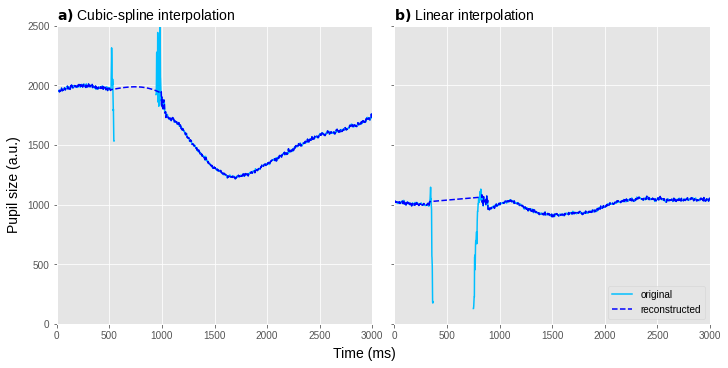
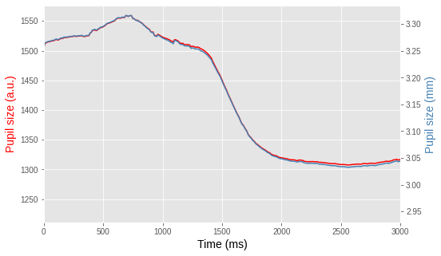
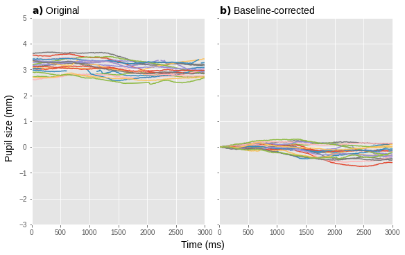
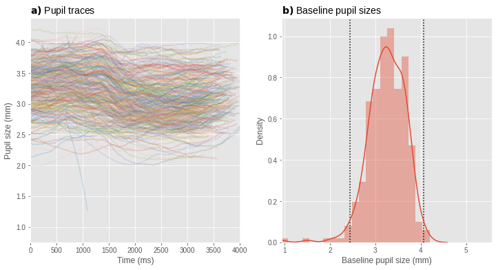
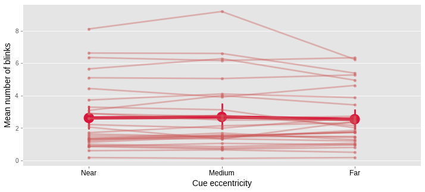
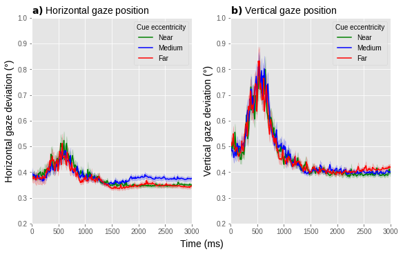
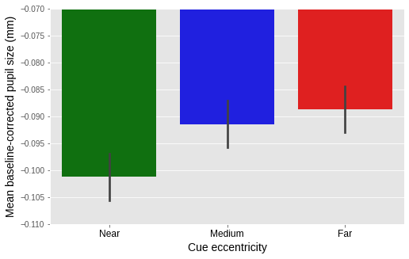
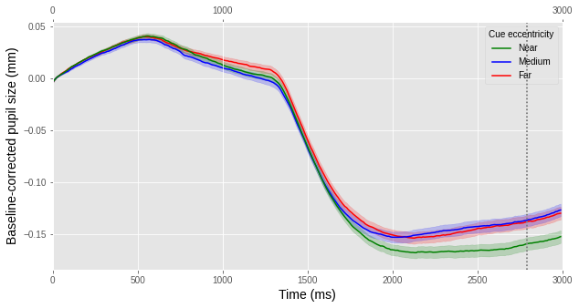

# Methods in Cognitive Pupillometry: Design, Preprocessing, and Statistical Analysis


This notebook contains code to reproduce all figures from:

- Mathôt, S., & Vilotijević, A. (in prep.) Methods in Cognitive Pupillometry: Design, Preprocessing, and Statistical Analysis

-----------------------

Step 0: Download data
---------------------

We are going to analyze the data from our example experiment.

You can download all data from: <https://osf.io/659pm/>. The file-folder structure should be as in the OSF project.

----------------------------

Step 1: Importing libraries
----------------------------

We start the analysis by importing relevant libraries. Most of the these libraries are part of the standard numerical Python libraries. 

DataMatrix and EyeLinkParser may need to be installed separately.


```
import eyelinkparser
from eyelinkparser import visualize
import datamatrix
from eyelinkparser import parse, defaulttraceprocessor
from datamatrix import functional as fnc, series as srs, NAN
from datamatrix import plot, operations as ops
import matplotlib.patches as mpatches 
from matplotlib import pyplot as plt
from matplotlib import lines
import matplotlib.lines as mlines
import numpy as np
from numpy import mean, absolute
import pandas as pd
import seaborn as sns
import time_series_test as tst

np.random.seed(42)  # Fix random seed for predictable outcomes
```

Step 2: Parsing raw data 
-------------------------------

First, we convert raw data (`.edf` format) into a Python DataMatrix by calling `eyelinkparser.parse()`. It is important to indicate a couple of things: for example, we don't want to log every phase (time-period) in our experiment, but only the one that we are going to analyze. Thus, in our experiment we focus only on the period before the target's presentation and thus specify this time-period by indicating phasemap (here: merged cue and stream period) and phasefilter. 

For the explanation of other arguments, check:

- <https://github.com/smathot/python-eyelinkparser>

The end product is a datamatrix (dm) consisting of experimental variables in columns, and trials in rows.


```
def only_stream(phase):
    return phase == 'stream'

@fnc.memoize(persistent=True)
def get_dm_part1():
    dm = eyelinkparser.parse(
        folder='data (first part)',  # This is where the data is
        gaze_pos=False,              # Don't store gaze-position information to save memory
        time_trace=False,            # Don't store absolute timestamps to save memory
        phasemap={'cue': 'stream'},  # Merge the cue into the stream phase
        phasefilter=only_stream)     # Only parse stream phase
    return dm

dm = get_dm_part1()
```

Step 3: Interpolating or removing missing and invalid data 
--------------------------------------------------------------

Next, we want to remove blinks from our signal and reconstruct the signal during these periods.

To do so, we call `blinkreconstruct()`, which takes the original signal as an argument (`ptrace_stream`) and lets the algorithm loop over the original signal, recognizing blinks and interpolating them (either by cubic-spline or linear interpolation). We plot example trials where cubic-spline (left panel) and linear interpolation (right panel) were applied. These trials were hand-selected after visual inspection.

The end product is reconstructed signal which we store in an additional column of the datamatrix (`reconstructed_stream`).


```
dm.reconstructed_stream = srs.blinkreconstruct(dm.ptrace_stream,
                                               mode='advanced')

# Plot original and reconstructed pupil traces
fig, axs = plt.subplots(1, 2, figsize=(10, 5), constrained_layout=True,
                        sharex=True, sharey=True)
fig.supxlabel("Time (ms)", fontsize=14)
fig.supylabel("Pupil size (a.u.)", fontsize=14)
row = dm[326]
plt.subplot(121)
plt.title(r"$\bf{" "a) " "}$" " Cubic-spline interpolation",
          fontsize=14, loc="left")
plt.plot(row.ptrace_stream, color="deepskyblue",
         label="original", linestyle="solid")
plt.plot(row.reconstructed_stream, color="blue",
         label="reconstructed", linestyle="dashed")
row = dm[194]
plt.subplot(122)
plt.title(r"$\bf{" "b) " "}$" " Linear interpolation",
          fontsize=14, loc="left")
plt.plot(row.ptrace_stream, color="deepskyblue",
         label="original", linestyle="solid")
plt.plot(row.reconstructed_stream, color="blue",
         label="reconstructed", linestyle="dashed")
plt.xlim(0, 3000)
plt.ylim(0, 2500)
plt.legend(loc="lower right")
plt.show()
```


    

    


    


Step 4: Downsampling (if necessary)
-----------------------------------

The sampling rate of EyeLink eye-tracker that we used is 1000Hz meaning that 1000 measurements were made per second. This is a lot, so in order to decrease memory consumption, we downsample the data by factor of 10, i.e. we reduce the sampling rate of the signal from 1000Hz to 100Hz.

The end product is a downsampled signal which we store in an additional column of the datamatrix (`downsampled`).


```
dm.downsampled = srs.downsample(dm.reconstructed_stream, by=10)
```


    /home/sebastiaan/anaconda3/envs/pydata/lib/python3.9/site-packages/datamatrix/series.py:1476: RuntimeWarning: Mean of empty slice
      return fnc(a.reshape(-1, by), axis=1)


Step 5: Converting pupil size to mm (if necessary)
----------------------------------------------------

Here, we convert pupil size from arbitrary units to millimeters of diameter in order to get a more realistic image of pupil-size changes. The conversion formula for our lab is mm = (0.00714*eyelink_units)**0.5.

The end product is pupil size expressed in mm, which we store in an additional column of the datamatrix (`ptrace_stream_mm`).


```
dm.ptrace_stream_mm = (0.00714*dm.downsampled)**0.5

# Plot the trace with double y axis [units]
fig, ax1 = plt.subplots(1, 1, figsize=(8, 5))
ax1.plot(dm.downsampled.mean, color='red')  # mean pupil trace in a.u.
ax2 = ax1.twinx()
ax2.plot(dm.ptrace_stream_mm.mean, color='steelblue')  # mean pupil trace in mm
ax1.set_xlabel('Time (ms)', color='black', fontsize=14)
plt.xlim(0, 300)
plt.xticks(range(0, 301, 50), range(0, 3010, 500))
ax1.set_ylabel('Pupil size (a.u.)', color='red', fontsize=14)
ax2.set_ylabel('Pupil size (mm)', color='steelblue', fontsize=14)
plt.grid(False)  # delete this for double grid
plt.show()
```


    

    


    


Step 6: Apply baseline correction
---------------------------------

The initial pupil size varies from trial to trial (and from participant to participant) adding noise (unless you are interested in examining these differences specifically) to the signal of interest. In order to decrease the noise, we apply baseline correction by subtracting mean baseline pupil size, bringing all pupil sizes to zero during the baseline period. To do so, we have to determine the baseline period first - here we use the first 50ms (first 5 samples) and we reduce it, i.e. we take a mean across this period, which is to-be-subtracted from each trial.

The end product is pupil size starting at 0 during the baseline period on every trial.


```
# taking a subset of trials for illustrative purpose
subset = dm[150:170]

# applying baseline correction on the entire dm, such that `baseline_corrected`
# contains a series that starts from 0
baseline_corrected = srs.baseline(
    subset.ptrace_stream_mm, subset.ptrace_stream_mm, 0, 5)

# getting mean pupil size during the first 50 ms. We refer to this as
# baseline pupil size. Note that this is a single value (per trial), which is
# different from the baseline-corrected signal, which is a series (per trial).
dm.baseline = srs.reduce(dm.ptrace_stream_mm[:, 0:5])

# Plot original and baseline-corrected pupil size
fig, axs = plt.subplots(1, 2, figsize=(
    8, 5), constrained_layout=True, sharex=True, sharey=True)
fig.supxlabel('Time (ms)', color='black', fontsize=14)
fig.supylabel('Pupil size (mm)', color='black', fontsize=14)
plt.subplot(121)  # original
plt.title(r"$\bf{" + 'a) ' + "}$" + ' Original', fontsize=14, loc='left')
plt.plot(subset.ptrace_stream_mm.plottable)
plt.xlim(0, 300)
plt.ylim(-3, 5)
plt.subplot(122)  # baseline-corrected
plt.title(r"$\bf{" + 'b) ' + "}$" +
          ' Baseline-corrected', fontsize=14, loc='left')
plt.plot(baseline_corrected.plottable)
plt.xlim(0, 300)
plt.xticks(range(0, 301, 50), range(0, 3010, 500))
plt.ylim(-3, 5)
```


    /home/sebastiaan/anaconda3/envs/pydata/lib/python3.9/site-packages/datamatrix/series.py:381: RuntimeWarning: Mean of empty slice
      a = operation(series, axis=1)
    (-3.0, 5.0)


    

    


    


Step 7: Verifying and visualizing data quality
-----------------------------------------------

Here we inspect data quality per participant by plotting individual trials as semi-transparent lines (left panel) and a histogram of baseline pupil sizes (right panel).


```
visualize.data_quality(dm, dm.ptrace_stream_mm, dm.baseline,
                       group=dm.subject_nr)
```


    Subject 11
    /home/sebastiaan/anaconda3/envs/pydata/lib/python3.9/site-packages/seaborn/distributions.py:2619: FutureWarning: `distplot` is a deprecated function and will be removed in a future version. Please adapt your code to use either `displot` (a figure-level function with similar flexibility) or `histplot` (an axes-level function for histograms).
      warnings.warn(msg, FutureWarning)


    

    


    Number of trials before removing outliers: N(trial) = 330
    Number of trials after removing outliers: N(trial) = 317


From this point onwards we're going to use the full dataset from our example experiment (N=30). Therefore, we parse the data again (second part), this time letting the `eyelinkparser.parse()` function perform many of the steps described for us.

Parse raw data 
--------------


```
def only_stream(phase):
    return phase == 'stream'


@fnc.memoize(persistent=True)
def get_dm_part2():

    dm = parse(
        traceprocessor=defaulttraceprocessor(
            blinkreconstruct=True,
            downsample=10,
            mode='advanced'),
        folder='data (second part)',
        multiprocess=16,
        phasemap={'cue': 'stream'},
        phasefilter=only_stream)
    dm.ptrace_stream = (0.00714*dm.ptrace_stream)**0.5
    dm.pupil_stream = srs.baseline(dm.ptrace_stream, dm.ptrace_stream, 0, 5)
    dm.pupil_stream.depth = 300
    dm.baseline = srs.reduce(dm.ptrace_stream[:, 0:5])
    dm.cue_ordinal = 0
    dm.cue_ordinal[dm.cue_eccentricity == 'far'] = 1
    dm.cue_ordinal[dm.cue_eccentricity == 'near'] = -1
    return dm[dm.pupil_stream, dm.baseline, dm.cue_eccentricity,
              dm.subject_nr, dm.cue, dm.correct, dm.response_time,
              dm.target_opacity, dm.practice, dm.blinkstlist_stream,
              dm.cue_ordinal, dm.xtrace_stream, dm.ytrace_stream]
    
# get_dm_part2.clear()  # clears cache
dm = get_dm_part2()
dm_with_practice = dm
dm_with_practice = dm_with_practice.cue == 'valid'
dm = dm.practice == 'no'
```

Step 8.1: Verifying and visualizing data quality: check blink rate
------------------------------------------------------------------

Here we plot mean blink rate as a function of experimental condition and participant.


```
def count_nonnan(a):
    return np.sum(~np.isnan(a))


dm.n_blinks = srs.reduce(dm.blinkstlist_stream, count_nonnan)

# aggregate data by subject and condition
pm = ops.group(dm, by=[dm.subject_nr, dm.cue_eccentricity])
# calculate mean blink rate per condition
pm.mean_blink_rate = srs.reduce(pm.n_blinks)

# Plot the mean blink rate as a function of experimental condition and
# participant
fig, ax1 = plt.subplots(1, 1, figsize=(12, 5))
x = sns.pointplot(
    x="cue_eccentricity",
    y="n_blinks",
    hue="subject_nr",
    order=['near', 'medium', 'far'],
    data=dm,
    ci=None,
    palette=sns.color_palette(['indianred']),
    markers='.')
plt.setp(x.lines, alpha=.4)
plt.setp(x.collections, alpha=.4)
sns.pointplot(
    x="cue_eccentricity",
    y="mean_blink_rate",
    order=['near', 'medium', 'far'],
    data=pm,
    linestyles='solid',
    color='crimson',
    markers='o',
    scale=2)
plt.xlabel('Cue eccentricity', color='black', fontsize=14)
plt.ylabel('Mean number of blinks', color='black', fontsize=14)
plt.legend([], [], frameon=False)
plt.xticks([0, 1, 2], ['Near', 'Medium', 'Far'], color='black', fontsize=12)
plt.show()
```


    /home/sebastiaan/anaconda3/envs/pydata/lib/python3.9/site-packages/datamatrix/py3compat.py:105: UserWarning: Failed to create series for SeriesColumn sblinkstlist_stream
      warnings.warn(safe_str(msg), *args)
    /home/sebastiaan/anaconda3/envs/pydata/lib/python3.9/site-packages/datamatrix/py3compat.py:105: UserWarning: Failed to create series for SeriesColumn spupil_stream
      warnings.warn(safe_str(msg), *args)
    /home/sebastiaan/anaconda3/envs/pydata/lib/python3.9/site-packages/datamatrix/py3compat.py:105: UserWarning: Failed to create series for SeriesColumn sxtrace_stream
      warnings.warn(safe_str(msg), *args)
    /home/sebastiaan/anaconda3/envs/pydata/lib/python3.9/site-packages/datamatrix/py3compat.py:105: UserWarning: Failed to create series for SeriesColumn sytrace_stream
      warnings.warn(safe_str(msg), *args)
    /home/sebastiaan/anaconda3/envs/pydata/lib/python3.9/site-packages/datamatrix/py3compat.py:105: UserWarning: Failed to create series for MixedColumn cue
      warnings.warn(safe_str(msg), *args)
    /home/sebastiaan/anaconda3/envs/pydata/lib/python3.9/site-packages/datamatrix/py3compat.py:105: UserWarning: Failed to create series for MixedColumn practice
      warnings.warn(safe_str(msg), *args)


    

    


    


Step 8.2: Verifying and visualizing data quality: check gaze position over time
-------------------------------------------------------------------------------

Here we plot the absolute difference between the x coordinate and horizontal display center over time (averaged across trials but separately for each experimental condition) in the left panel and the absolute difference between the y coordinate and vertical display center in the right panel.


```
center_x = 960  # 1920/2 = 960; horizontal display resolution divided by 2
center_y = 540  # 1080/2 =540; vertical display resolution divided by 2
# computing the absolute values
dm.xsubtrace = (dm.xtrace_stream - center_x) @ np.abs
dm.ysubtrace = (dm.ytrace_stream - center_y) @ np.abs
# converting to visual degrees (34.6 px/°)
dm.xdegree = dm.xsubtrace / 34.6
dm.ydegree = dm.ysubtrace / 34.6
# Plot horizontal and vertical gaze position
fig, axs = plt.subplots(1, 2, figsize=(
    8, 5), constrained_layout=True, sharex=True, sharey=False)
fig.supxlabel('Time (ms)', color='black', fontsize=14)
dmnear, dmmedium, dmfar = ops.split(
    dm.cue_eccentricity, 'near', 'medium', 'far')
plt.subplot(121)
plt.title(r"$\bf{" + 'a) ' + "}$" +
          ' Horizontal gaze position', fontsize=14, loc='left')
plot.trace(dmnear.xdegree, color='green', label='near')
plot.trace(dmmedium.xdegree, color='blue', label='medium')
plot.trace(dmfar.xdegree, color='red', label='far')
plt.ylabel('Horizontal gaze deviation (°)', color='black', fontsize=14)
near_line = mlines.Line2D([], [], color='green', label='Near')
medium_line = mlines.Line2D([], [], color='blue', label='Medium')
far_line = mlines.Line2D([], [], color='red', label='Far')
plt.legend(handles=[near_line, medium_line, far_line], title='Cue eccentricity')
plt.ylim(0.2, 1.0)
plt.xlim(0, 300)
plt.xticks(range(0, 301, 50), range(0, 3010, 500))
plt.subplot(122)
plt.title(r"$\bf{" + 'b) ' + "}$" +
          ' Vertical gaze position', fontsize=14, loc='left')
plot.trace(dmnear.ydegree, color='green', label='near')
plot.trace(dmmedium.ydegree, color='blue', label='medium')
plot.trace(dmfar.ydegree, color='red', label='far')
plt.ylabel('Vertical gaze deviation (°)', color='black', fontsize=14)
near_line = mlines.Line2D([], [], color='green', label='Near')
medium_line = mlines.Line2D([], [], color='blue', label='Medium')
far_line = mlines.Line2D([], [], color='red', label='Far')
plt.legend(handles=[near_line, medium_line, far_line], title='Cue eccentricity')
plt.xlim(0, 300)
plt.xticks(range(0, 301, 50), range(0, 3010, 500))
plt.ylim(0.2, 1.0)
plt.show()
```


    

    


    


Step 9: Remove outliers
--------------------------

Finally, we exclude trials based on baseline pupil size. To do so, we first convert baseline pupil size to z-scores and exclude trials with ±2 z-scores.


```
dm.z_baseline = ''
for subject_nr, sdm in ops.split(dm.subject_nr):
    dm.z_baseline[sdm] = ops.z(sdm.baseline)
print('Before removing outliers: N(trial) = {}'.format(len(dm)))
dm = dm.z_baseline >= -2
dm = dm.z_baseline <= 2
print('After removing outliers: N(trial) = {}'.format(len(dm)))
```


    Before removing outliers: N(trial) = 7200
    After removing outliers: N(trial) = 6798


Step 10.1: Visualization: Linear Mixed Effects
----------------------------------------------
Based on the literature, we assumed that our effect will probably emerge 750ms after cue onset, so we run a Linear Mixed Effects analysis on a pre-determined time-window (750-3000ms). We plot mean baselined pupil size during the pre-determined time window as a function of cue eccentricity. 


```
dm.mean_pupil = srs.reduce(dm.pupil_stream[:, 75:300])
dm_valid_data = dm.mean_pupil != NAN
#Plot LME results
fig,ax1 = plt.subplots(1,1, figsize=(8, 5))
sns.barplot(x='cue_eccentricity', y='mean_pupil', data=dm, order=['near', 'medium', 'far'],  palette = ['green','blue', 'red'], ci=68)
plt.ylabel('Mean baseline-corrected pupil size (mm)',color ='black', fontsize=14)
plt.xlabel('Cue eccentricity',color ='black', fontsize=14)
ax1.set_ylim(-.11, -0.07)
plt.xticks([0, 1, 2], ['Near', 'Medium', 'Far'], color ='black', fontsize=12)
plt.show()
```


    

    


    


Step 10.1: Visualization: Cross-validation
------------------------------------------

The alternative (and recommended) approach to data analysis is cross-validation. Here, we plot the results in a form of a pupil trace as a function time with cue eccentricities as separate lines. The vertical dashed line indicates mean of the tested samples suggesting when, approximately, the effect of cue eccentricity occurs most strongly.


```
# First run cross-validation

del dm.xtrace_stream
del dm.ytrace_stream

dm.pupil_75 = dm.pupil_stream[:,75:]


results = tst.find(dm, 'pupil_75 ~ cue_ordinal', groups='subject_nr',
                   re_formula='~ cue_ordinal',
                   suppress_convergence_warnings=True)
print(tst.summarize(results))
# Plot results
fig,ax1 = plt.subplots(1,1, figsize=(10, 5))
tst.plot(dm, dv='pupil_stream',
         hue_factor='cue_eccentricity',
         hues = ['red','blue','green'])
near_line = mlines.Line2D([], [], color='green', label='Near')
medium_line = mlines.Line2D([], [], color='blue', label='Medium')
far_line = mlines.Line2D([], [], color='red', label='Far')
plt.legend(handles=[near_line, medium_line, far_line], title='Cue eccentricity')
ax1.set_ylabel('Baseline-corrected pupil size (mm)',color ='black', fontsize=14)
ax2 = ax1.twiny()
new_tick_locations = np.array([0, 100, 300])
ax2.set_xticks(new_tick_locations)
ax2.set_xticks([0,100, 300], [0,1000, 3000])
mean_samples = (261+297)/2
plt.axvline(mean_samples,color='gray',linestyle=':')
ax1.set_xlabel('Time (ms)',color ='black',fontsize=14)
plt.xlim(0, 300)
ax1.set_xticks(range(0, 301, 50), range(0, 3010,500))
plt.axvline(mean_samples,color='gray',linestyle=':')
ax1.set_xlabel('Time (ms)',color ='black',fontsize=14)
plt.xlim(0, 300)
ax1.set_xticks(range(0, 301, 50), range(0, 3010,500))
plt.show()
```


    /home/sebastiaan/anaconda3/envs/pydata/lib/python3.9/site-packages/time_series_test.py:301: RuntimeWarning: Mean of empty slice
      mean_signal[row] = np.nanmean(signal[row, index:index + winlen])
    /home/sebastiaan/anaconda3/envs/pydata/lib/python3.9/site-packages/time_series_test.py:301: RuntimeWarning: Mean of empty slice
      mean_signal[row] = np.nanmean(signal[row, index:index + winlen])
    /home/sebastiaan/.local/lib/python3.9/site-packages/statsmodels/regression/mixed_linear_model.py:1634: UserWarning: Random effects covariance is singular
      warnings.warn(msg)
    Intercept was tested at samples {101, 109} → z = -7.1766, p = 7.146e-13
    cue_ordinal was tested at samples {186, 222} → z = 2.9173, p = 0.003531
    None


    

    


    


