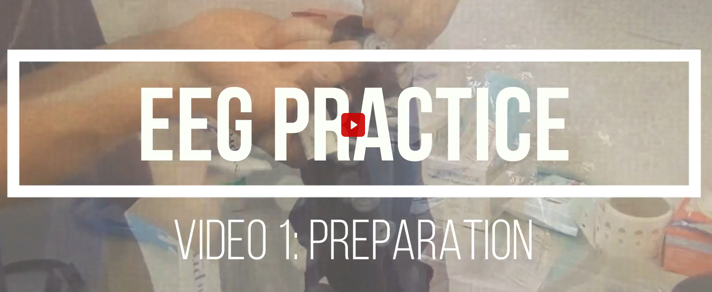
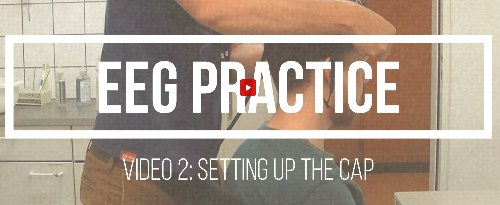
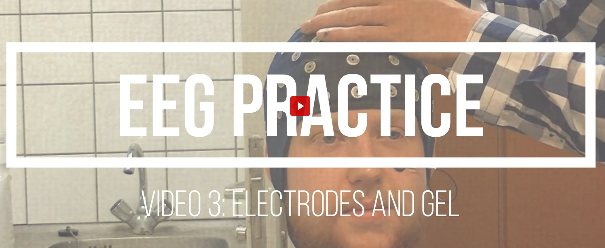
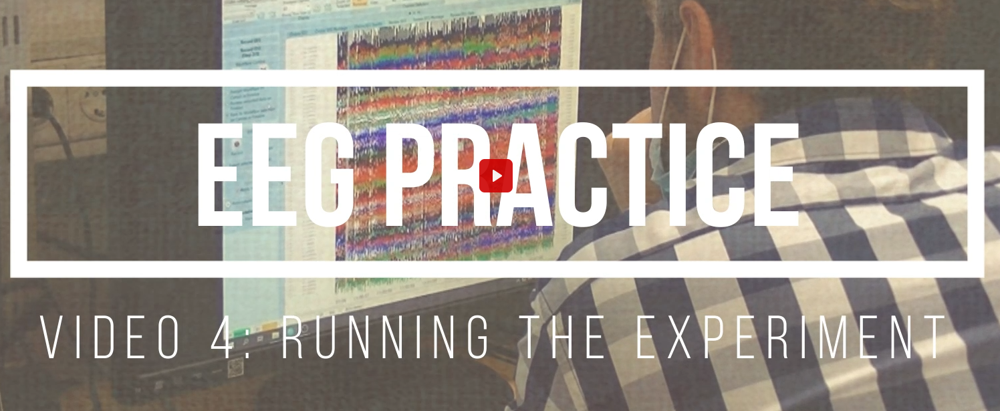
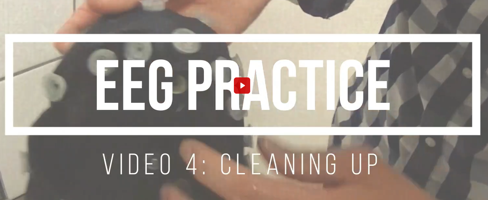
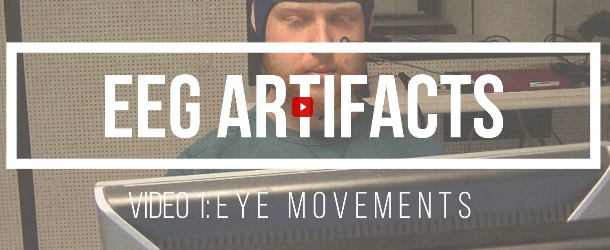
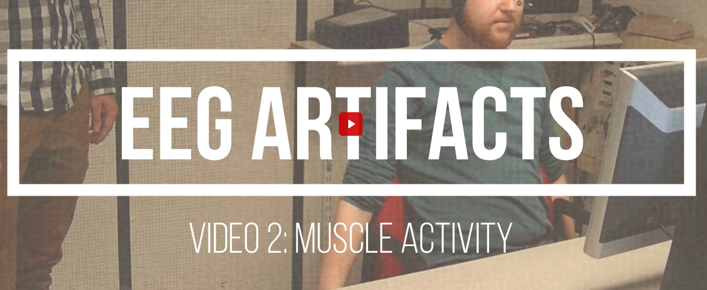

Electroencephalography (EEG) is a method for measuring electrical activity of the brain using electrodes placed on the scalp. EEG provides high temporal resolution and is widely used to study neural responses to sensory, cognitive, and motor processes.

## What is EEG used for?

EEG can be used to measure:

- Event-related potentials (ERPs)
- Oscillatory brain activity
- Neural responses to sensory stimulation
- Brain activity during cognitive tasks

In this department, EEG is commonly combined with:

- Behavioral tasks
- Eye tracking
- Stimulation techniques or other psychophysiological measures (e.g. skin conductance)

Please note that **not all labs support all combinations of EEG with other measurement techniques**.

## EEG facilities

The Experimental Psychology department uses **TMSi EEG systems**, available in the following labs:

- **H-184** (Heymans Building, basement)
- **H-186** (Heymans Building)

## Typical workflow for an EEG study

1. Build the experiment using OpenSesame.
2. Test the experiment locally without EEG to verify logic and timing.
3. Run and test the experiment on the experiment computer with the EEG system connected.
4. Verify that output files are generated correctly.
5. If everything works as expected, start data collection.
6. Prepare the participant and apply the EEG cap.
7. Collect data and verify the output files after each session.

## Participant preparation

EEG preparation involves placing an EEG cap on the participant’s head and filling electrodes with conductive gel.

Typical preparation steps:

- Ask the participant to remove earrings, necklaces, and chewing gum.
- Clean electrode locations on the scalp and around the eyes.
- Apply the EEG cap.
- Fill electrodes with electrode gel.
- Check electrode impedance.
- Ensure signal quality before starting the experiment.

  

    
    
<em>Video 1: Preparation</em>

  

  

    
    
<em>Video 2: Setting up the cap</em>

  

  

    
    
<em>Video 3: Electrodes and gel</em>

  

  

    
    
<em>Video 4: Running the experiment</em>

  

## After the session

After completing the experiment:

- Remove the EEG cap.
- Clean the electrodes and cap thoroughly.
- Store equipment properly.
- Back up the recorded data.

    
    
<em>Video 5: Cleaning up</em>

  

## Data handling

After each session:

- Verify that EEG data files were recorded correctly.
- Copy the data to the appropriate project folder.
- Back up the data to a secure storage location.

  

    
    
<em>Video 6: Artifacts: eye movements</em>

  

  

    
    
<em>Video 7: Artifacts: muscle activity</em>

  

## Important notes

- Always test experiments before running participants.
- Ensure impedance levels are acceptable before starting recordings.
- Keep lighting and electrical noise sources minimal during EEG recordings.
