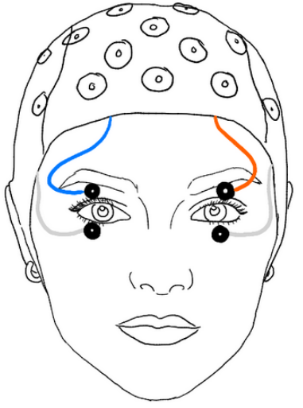

# Electroretinography (ERG)

Electroretinography (ERG) is a technique used to measure electrical responses of the retina to visual stimulation. It provides a direct, physiological measure of retinal activity and complements cortical measures such as EEG.

---

## What does ERG measure?

ERG captures the summed electrical activity of retinal cells, including:

- Photoreceptors (rods and cones)
- Bipolar cells
- Retinal ganglion cells (indirectly)

These responses are typically time-locked to visual stimuli such as flashes or luminance changes.

---

## Why use ERG?

ERG allows researchers to:

- Measure early visual processing at the retinal level  
- Study how stimulus properties (e.g., brightness, contrast, color) affect retinal activity  
- Combine retinal signals with pupil size measurements

---

## ERG in our lab

In our setup, ERG is recorded using **electrodes from the EEG cap**, specifically using channels typically assigned for EOG.

### Placement

- Electrodes are placed on the **eyelids**
- Reference and ground follow the standard EEG setup

  
  
<em>Electrode placement for ERG recording </em>

---

## Signal characteristics

ERG signals recorded in this way are:

- Fast responses (milliseconds after stimulus onset)
- Sensitive to luminance changes and flashes  

---

## Experimental considerations

When using ERG in this configuration:

- Use **high-contrast or luminance-modulated stimuli**
- Ensure **good electrode contact** on the eyelids  

---

## Relation to other measures

ERG is often used together with:

- **EEG** → cortical processing  
- **Eye tracking** → gaze behavior  
- **Pupillometry** → pupil responses  

This combination allows a multi-level understanding of visual processing.

---

